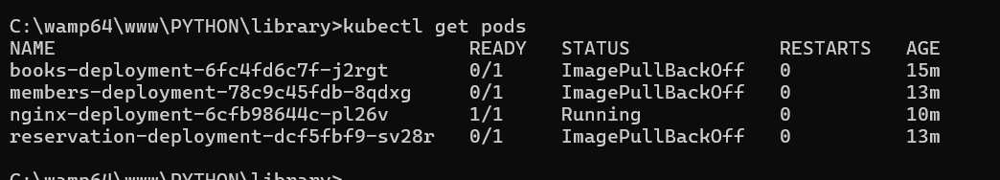
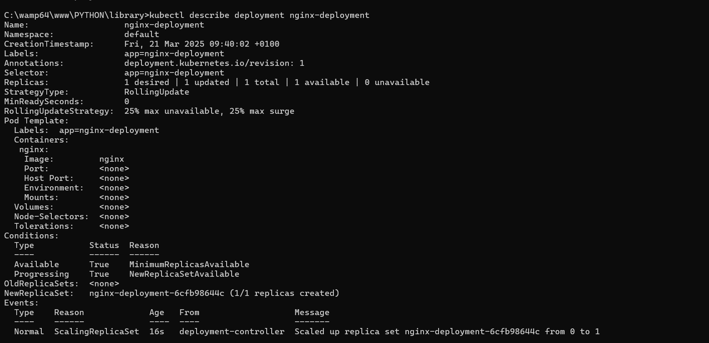
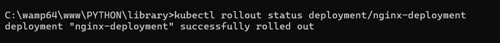
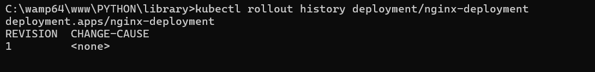
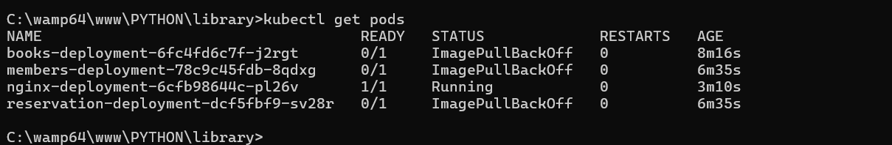

# Livrables - Exercice Pratique : Déploiement, Mise à Jour, Scaling et Rollback sur Kubernetes

Ce document présente l'ensemble des livrables de l'exercice pratique réalisé sur Kubernetes. Vous devez joindre des captures d'écran (ou copier les résultats de commandes) pour chaque étape. Remplacez les indications **[INSÉRER CAPTURE]** par vos images ou résultats.

---

## 1. Capture d'écran : Liste des Pods

**Commande exécutée :**
```bash
kubectl get pods
```

**Capture d'écran / Résultat :**



---

## 2. Capture d'écran : Détails du Déploiement

**Commande exécutée :**
```bash
kubectl describe deployment nginx-deployment
```

**Capture d'écran / Résultat :**



---

## 3. Capture d'écran : Rollout Status du Déploiement

**Commande exécutée :**
```bash
kubectl rollout status deployment/nginx-deployment
```

**Capture d'écran / Résultat :**



---

## 4. Capture d'écran : Historique des Rollouts

**Commande exécutée :**
```bash
kubectl rollout history deployment/nginx-deployment
```

**Capture d'écran / Résultat :**

<!-- Remplacez le chemin par l'emplacement réel de votre capture -->

---

## 5. Capture d'écran : Logs des Pods (en cas d'erreur)

**Commande exécutée :**
```bash
kubectl logs -l app=nginx
```

**Capture d'écran / Résultat :**




## Rapport


> **Différences entre RollingUpdate et Recreate :**  
> RollingUpdate effectue une mise à jour progressive, garantissant une haute disponibilité de l'application, tandis que Recreate arrête tous les pods puis les recrée, ce qui peut provoquer une interruption temporaire.
>
> **Scaling manuel :**  
> Lorsque le nombre de réplicas a été augmenté à 5, de nouveaux pods ont été créés sans interruption. En revenant à 3 réplicas, les pods excédentaires ont été correctement supprimés.
>
> **Déploiement problématique et rollback :**  
> La mise à jour vers une image inexistante a généré des erreurs, confirmées par les logs des pods. Le rollback a restauré la version stable précédente, comme vérifié avec l'historique des déploiements.

---

## Conclusion

Ce document rassemble les livrables demandés pour cet exercice sur Kubernetes. Assurez-vous d'ajouter toutes vos captures d'écran et de compléter le rapport pour valider l'exercice.

