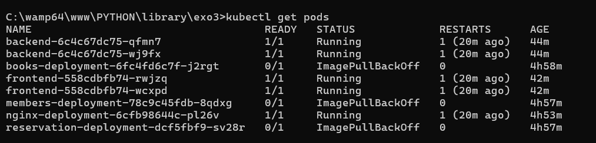
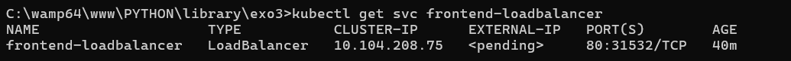
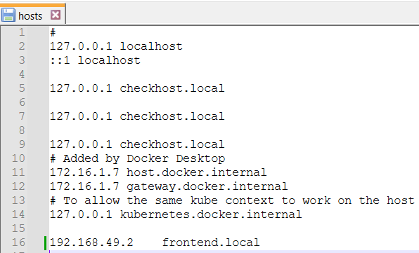

# Exercice Kubernetes : Exposition d'une application via différents types de Services et Ingress

## Objectif pédagogique
- Déployer une application web multi-tier dans Kubernetes.
- Configurer différents types de Services : ClusterIP, NodePort, LoadBalancer.
- Installer un Ingress Controller (comme NGINX) et définir des règles de routage.
- Tester l’accessibilité de l’application à travers chaque méthode.

---

## Déploiement d'une application multi-tier

### Backend

1. **Déploiement du backend** :
    - Créez un fichier `backend-deployment.yaml` :
      ```yaml
      apiVersion: apps/v1
      kind: Deployment
      metadata:
        name: backend
      spec:
        replicas: 2
        selector:
          matchLabels:
            app: backend
        template:
          metadata:
            labels:
              app: backend
          spec:
            containers:
            - name: backend
              image: kennethreitz/httpbin
              ports:
              - containerPort: 80
      ```
    - Appliquez le fichier :
      ```bash
      kubectl apply -f backend-deployment.yaml
      ```
    - *Capture d'écran* : Sortie de la commande `kubectl get pods` montrant les pods backend en cours d'exécution.
      
2. **Service ClusterIP** :
    - Créez un fichier `backend-service.yaml` et appliquez-le :
      ```bash
      kubectl apply -f backend-service.yaml
      ```
    - **Résultat** :
      ```
      service/backend-service created
      ```

---

### Frontend

1. **Déploiement du frontend** :
    - Créez un fichier `frontend-deployment.yaml` et appliquez-le :
      ```bash
      kubectl apply -f frontend-deployment.yaml
      ```
    - **Résultat** :
      ```
      deployment.apps/frontend created
      ```

---

## Configuration de différents types de Services

### Service NodePort

1. **Service NodePort pour le frontend** :
    - Créez un fichier `frontend-nodeport-service.yaml` et appliquez-le :
      ```bash
      kubectl apply -f frontend-nodeport-service.yaml
      ```
    - **Résultat** :
      ```
      service/frontend-nodeport created
      ```

---

### Service LoadBalancer

1. **Service LoadBalancer pour le frontend** :
    - Créez un fichier `frontend-loadbalancer-service.yaml` et appliquez-le :
      ```bash
      kubectl apply -f frontend-loadbalancer-service.yaml
      ```
    - **Résultat** :
      ```
      service/frontend-loadbalancer created
      ```
    - **Vérification de l'adresse IP externe** :
      ```bash
      kubectl get svc frontend-loadbalancer
      ```
    - *Capture d'écran* : Sortie de la commande `kubectl get svc` montrant l'adresse IP externe attribuée.

---

## Ingress Controller et Ingress Resource

### Installation de NGINX Ingress Controller

1. **Installer NGINX Ingress Controller** :
   ```bash
   kubectl apply -f https://raw.githubusercontent.com/kubernetes/ingress-nginx/controller-v1.1.0/deploy/static/provider/cloud/deploy.yaml

## Création d'un Ingress pour le frontend
### Créez un fichier frontend-ingress.yaml et appliquez-le :

   ```bash
kubectl apply -f frontend-ingress.yaml
   ```
### Erreur rencontrée :

``
Error from server (InternalError): error when creating "frontend-ingress.yaml": Internal error occurred: failed calling webhook "validate.nginx.ingress.kubernetes.io": failed to call webhook: Post "https://ingress-nginx-controller-admission.ingress-nginx.svc:443/networking/v1/ingresses?timeout=10s": dial tcp 10.107.197.1:443: connect: connection refused
``

### Ajout d'une entrée locale



Accès via navigateur ou curl
Testez avec la commande :
``
curl http://frontend.local
``

